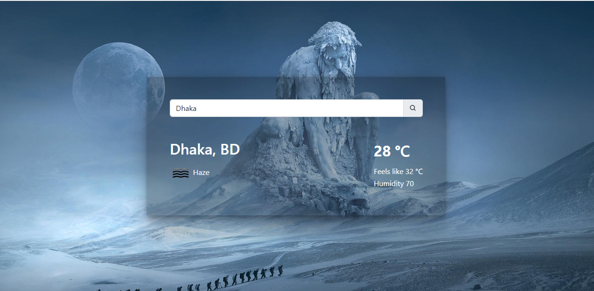

## Getting Started

First, run the development server:

```bash
1. yarn
2. yarn run dev
# or
1. npm install
2. npm run dev
```

Open [http://localhost:3000](http://localhost:3000) with your browser to see the result.